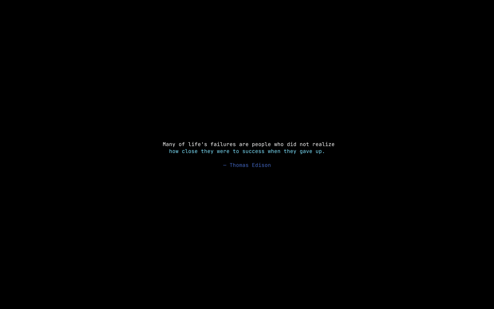

# nirisaver

A screensaver for [niri](https://github.com/YaLTeR/niri), and for any Wayland
compositor with `wlr-layer-shell`. It draws animated text across every output —
a rotating quotation, or a block of your own — and gets out of the way on the
first key, pointer move, click or `SIGTERM`.



It is a native Wayland client: one layer surface per output, `wl_shm` buffers,
software glyph rasterization with [fontdue](https://github.com/mooman219/fontdue),
and [ttfx](https://github.com/omacom-io/ttfx) linked as a crate for the
animation itself. There is no terminal, no pty, and no child process.

## Contents

- [Install](#install)
- [Running it](#running-it)
- [Configuration](#configuration)
- [Command line](#command-line)
- [Effects](#effects)
- [Performance](#performance)
- [Notes from the compositor](#notes-from-the-compositor)
- [Keyboard input](#keyboard-input)
- [Development](#development)
- [Credits](#credits)

## Install

Needs a Rust toolchain. Nothing else — no C compiler, no `pkg-config`, no
Wayland headers, no `libxkbcommon`, no system font. The protocol bindings are
generated by the crates, the font is bundled, and the toolkit's default
features are off (see [Keyboard input](#keyboard-input)). The resulting binary
links nothing but libc, libm and libgcc, which CI asserts on every push.

```bash
git clone https://github.com/saifulapm/nirisaver ~/.local/src/nirisaver
cd ~/.local/src/nirisaver
make
make install PREFIX=~/.local          # → ~/.local/bin/nirisaver
```

## Running it

```bash
nirisaver
```

That is the whole interface. It maps an overlay on every output, animates, and
exits when you touch anything. Everything else lives in the config file.

It is meant to be launched by an idle service. Two things make that work:

- **It polices itself.** The surface takes an exclusive keyboard grab, so
  nothing needs to watch for the dismissal or clean up afterwards.
- **It is single-instance.** A second launch while one is up exits `0`
  immediately — the caller asked for the screensaver to be on screen, and it
  is. The lock is an `flock` on `$XDG_RUNTIME_DIR/nirisaver.lock`.

`SIGTERM` is a first-class dismissal: it fades out and exits, rather than being
torn off the screen.

## Configuration

`~/.config/nirisaver/config.toml`, honouring `$XDG_CONFIG_HOME`. Every key is
optional and every one has a flag that overrides it. A missing file is not an
error; an unknown key is.

```toml
# What to animate: "quotes" (the default) or "text".
source = "quotes"

# --- quotes -----------------------------------------------------------------
# One per line, "text <separator> author". Blank lines and `#` comments are
# ignored, so a long list can be sectioned. Defaults to
# ~/.config/nirisaver/quotes.txt if that file exists.
quotes = "~/.config/nirisaver/quotes.txt"

# What splits a quotation from its attribution. Matched from the right, so a
# quotation may contain the separator itself.
separator = " — "

# What the attribution line opens with once it has been moved onto its own
# line. Separate from the separator on purpose: a list can use "|" as its field
# separator and still want a dash on screen.
attribution-prefix = "— "

# --- custom text ------------------------------------------------------------
# With source = "text", one of these. Naming either one implies source = "text".
# text = "be excellent to each other"
# text-file = "~/.config/nirisaver/banner.txt"

# --- typography -------------------------------------------------------------
wrap = 64             # wrap measure, in columns
align = "center"      # or "left"
font-size = 18.0      # logical pixels, before output scaling
line-height = 1.0     # multiple of the font's own line height
# font = "/usr/share/fonts/jetbrains-mono-fonts/JetBrainsMono-Regular.otf"
background = "#000000"
foreground = "#ebebeb"   # for text an effect leaves unstyled

# --- timing -----------------------------------------------------------------
hold = 14000          # ms a finished frame stays readable before the next cycle
fade-in = 700
fade-out = 250
frame-rate = 30       # animation frames per second

# --- effects ----------------------------------------------------------------
# Pick exactly one of these three shapes. With none of them, every cycle draws
# a random effect from the whole registry.
# effect = "matrix"                            # pin one
# include-effects = ["beams", "rain", "waves"] # draw only from these
# exclude-effects = ["smoke", "vhstape"]       # draw from everything else

# Replay a run exactly: which quote, which effect, every frame.
# seed = 1234
```

There is a copy of this at [`config.example.toml`](config.example.toml).

### Where the defaults come from

Configuration is resolved **once, at startup**, into a plain struct that is
passed downward. Nothing below that point reads a file or an environment
variable, and no constructor consults `$XDG_CONFIG_HOME` on its way to a
default.

That is a hard rule rather than a preference. A `Default` that reaches for the
config directory means the same code renders different things on different
machines — and the first thing that quietly stops meaning anything is the
benchmark, which is supposed to render identical frames everywhere and instead
renders whatever happens to be in the developer's quote list.
`Settings::builtin()` is the machine-independent starting point that keeps this
honest, and the benchmark starts from it.

## Command line

Every flag overrides the matching config key.

```
Usage: nirisaver [OPTIONS]

Options:
  -c, --config <PATH>              Config file to read
                                   (default: $XDG_CONFIG_HOME/nirisaver/config.toml)
      --no-config                  Ignore the config file entirely
      --source <KIND>              What to animate: quotes, text
      --quotes <PATH>              Quote list: one per line, "text <separator> author"
      --separator <STR>            What splits a quote from its attribution
      --attribution-prefix <STR>   What the attribution line opens with
      --text <STR>                 A block of text to animate, given inline
      --text-file <PATH>           A block of text to animate, read from a file
      --align <ALIGN>              center or left
      --wrap <COLS>                Wrap measure, in columns
      --hold <MS>                  How long a finished frame stays readable
      --fade-in <MS>               Fade-in duration
      --fade-out <MS>              Fade-out duration
      --frame-rate <FPS>           Animation frames per second
      --effect <NAME>              Pin one effect for every cycle
      --include-effects <NAME>...  Draw each cycle's effect only from these
      --exclude-effects <NAME>...  Draw each cycle's effect from everything except these
      --list-effects               Print every available effect and exit
      --font <PATH>                A TrueType or OpenType font to render with
      --font-size <PX>             Font size in logical pixels, before output scaling
      --line-height <RATIO>        Cell height as a multiple of the font's line height
      --background <HEX>           Surface background colour, as #rrggbb
      --foreground <HEX>           Colour for text the effect leaves unstyled
      --seed <N>                   Seed the animation, so a run replays exactly
      --headless                   Render without a compositor
      --frames <N>                 Headless: how many frames to render
      --cols <N>                   Headless: grid width in cells
      --rows <N>                   Headless: grid height in cells
      --dump-grid                  Headless: print the cell grid as well as the summary
  -h, --help                       Print help
  -V, --version                    Print version
```

### Headless mode

A deterministic render path with no Wayland at all. Given a seed it prints a
fixed string, which is how the layout and content logic are tested in CI:

```console
$ nirisaver --no-config --headless --frames 400 --cols 72 --rows 20 --seed 4242 --hold 500
grid=72x20 presented=400 engine-frames=637 cycles=1 cells-changed=3793 last-effect=rings checksum=6896f6a1c70f5737
```

`--dump-grid` prints the final cell grid underneath, which is the quickest way
to check a wrap measure or a separator without putting anything on screen.

That line is the same on any machine and any architecture — CI asserts it
character for character on x86_64, and it is what an arm64 laptop prints.
`--no-config` is what makes it so: it ignores the whole config directory,
config.toml and the default quote list both. Half-doing that was a real bug —
a quote list draws an RNG value that a plain text block does not, so a machine
with quotes installed diverged from one without on the very first effect.

## Effects

Whatever ttfx exposes. Right now:

```
beams          binarypath     blackhole      bouncyballs    bubbles
burn           colorshift     crumble        decrypt        errorcorrect
expand         fireworks      highlight      laseretch      matrix
middleout      orbittingvolley overflow      pour           print
rain           randomsequence rings          scattered      slice
slide          smoke          spotlights     spray          swarm
sweep          synthgrid      thunderstorm   unstable       vhstape
waves          wipe
```

`nirisaver --list-effects` prints the live list. Names are validated at
startup: a name ttfx does not know is an error naming the alternatives, not a
cycle that quietly animates something else.

## Performance

Measured on the machine this was written on — an Apple M-series MacBook running
Fedora Asahi, niri 26.04, `cargo 1.97.1`, release build. Reproduce with
`make benchmark`.

The benchmark renders a seeded effect at **5120×2880** and, on every frame,
**verifies the incremental buffer byte-for-byte against a full-frame oracle**.
It reads nothing outside this repository. Two workloads, because the answer
depends enormously on how much of the screen an effect is moving and one number
would hide that:

| workload | what it is | incremental | full buffer | speedup |
| --- | --- | --- | --- | --- |
| `paragraph` | a wrapped quote under `decrypt`, `binarypath`, `matrix`, `beams` — effects that keep rewriting cells they have already written | **0.740 ms/frame** (p95 0.891) | 1.964 ms/frame | **2.7×** |
| `wordmark` | a short centred word under `decrypt` — what most of a cycle looks like once the text has settled | **0.041 ms/frame** (p95 0.052) | 1.284 ms/frame | **31×** |

Per frame, at a 232×60 grid of 22×48 px cells:

| | `paragraph` | `wordmark` |
| --- | --- | --- |
| cells moved | 359 of 13920 (2.6%) | 5 of 13920 (0.04%) |
| cells redrawn | 717 | 6 |
| damage rectangles | 17.9 | 1.0 |
| allocations | 10.7 | 4.0 |

Redrawn runs at roughly twice moved because there are two buffers: the one
being drawn into holds the frame from *two* presentations ago, so it is two
frames of change behind. That is the standing price of not deadlocking on
`wl_buffer.release`, and it is worth paying — see below.

**Idle costs nothing.** While holding a finished frame there is no VT parse, no
rasterization and no commit — the event loop blocks on `poll` until the hold
expires and the process is not scheduled at all. Measured on a live overlay,
sampling `/proc/<pid>/stat`:

```
settled:            cpu_ticks=12
after 4s of hold:   cpu_ticks=12   (delta = 0 ticks of 100/s)
```

Not one 10 ms tick over four seconds. An identical frame is never re-presented,
because a serial is compared rather than a grid diffed.

### Memory

On this output — logical 1707×1067 at fractional scale 1.5, so niri advertises
`wl_output.scale` of 2 and the client draws 3414×2134 — a live overlay's peak
resident set is **72.7 MiB**, of which **56.9 MiB is the two shm buffers** and
the rest is the binary, the glyph cache and the animation engine.

Two buffers is the floor for correctness, not a choice (again, see below).
Schemes that would cost less were considered and rejected:

- **Smaller tiles**, presenting a subsurface per damaged region, would cut the
  shm allocation but multiply surfaces, configures and commits — and a
  screensaver's whole job is to cover the screen, so the full-size buffer has
  to exist somewhere regardless.
- **A damage scheme tolerant of buffer reuse** does not help: the memory is the
  buffers, and the reason there are two is release timing, not damage
  tracking. Tracking better cannot make one buffer safe.
- **A narrower pixel format** would halve it, but `wl_shm` guarantees only
  `ARGB8888` and `XRGB8888`, and the fade needs the alpha.

What *does* move the number is the animation engine, not the buffers. ttfx's
per-character state at a 155×44 grid ranges from ~10 MB for most effects to
~148 MB (`beams`) and ~199 MB (`smoke`) for the two heaviest, measured
headlessly with no buffers in play. If that matters on your machine, name them
in `exclude-effects`; the rest of the registry is unaffected.

### Fractional scale

`wp_fractional_scale_v1` plus `wp_viewporter` would let this output be drawn at
2560×1600 rather than 3414×2134 — 1.8× fewer pixels, so ~32 MiB of buffers
instead of ~57 MiB, and a 1:1 map to the panel with no compositor resample.
That is a real win and it is **not implemented**, deliberately: the integer
path is proven, the numbers above are already comfortably inside a 33 ms frame
budget, and adopting a second scaling protocol on the strength of an arithmetic
argument is how the surface ends up subtly wrong on the compositors nobody
tested. It is the first thing to try if this ever needs to be cheaper.

## Notes from the compositor

Five things that cost real time to find, kept here so the next person does not
have to find them again.

### niri does not release shm buffers promptly

A client with one reusable buffer per output, waiting for `wl_buffer.release`
before redrawing, **deadlocks**. Nothing in the protocol promises a deadline on
release: a compositor holding your only attached buffer may keep it
indefinitely, and niri does. Release arrives when a *different* buffer is
attached — so one buffer deadlocks against itself.

Proven with `WAYLAND_DEBUG=1`: attach, damage, frame, commit, one frame
callback, then zero protocol traffic for sixty-five seconds and not one release
event in the entire trace. With a fade-in, the single frame that did get
presented is the near-transparent first one, which makes the symptom a
**fullscreen invisible overlay holding an exclusive keyboard grab** — the worst
possible way for this program to fail.

This is a client bug, not a niri bug. The fix is two buffers per output, drawing
into whichever is free, and skipping the frame when neither is. That last part
is honest backpressure, not a workaround.

### Damage must describe the screen, not the buffer

With more than one buffer in flight, the buffer you are about to draw into
holds the frame from *two* presentations ago while the compositor is showing
the one from the last. Those are different pictures, and they answer different
questions:

- **What must I repaint?** Whatever differs from what is in *this buffer*.
- **What must I report as damaged?** Whatever differs from what is *on screen*.

They come apart whenever a cell changes and changes back — `X`, `Y`, `X` over
three frames. On the third frame the buffer still holds the original `X`, so
the buffer diff is empty; the screen holds `Y`, so the screen diff is not. A
client that damages only its buffer diff tells a compositor that takes damage
at its word that nothing moved, and the `Y` stays on screen. Effects that churn
glyphs hit this on essentially every frame.

So: keep a record of the last *presented* grid as well as each buffer's, and
report damage covering both. `tests/damage.rs` builds a compositor that copies
exactly the rectangles it was told about and nothing else, and compares the
result against a full-render oracle. It carries a negative control — the same
run with buffer-only damage, which must leave the screen stale — so the test
cannot quietly stop distinguishing the two records.

### Hide the cursor through the protocol

`wl_pointer.set_cursor(serial, None, 0, 0)` on pointer enter. A null cursor
surface is the protocol's own way to say "no cursor over my surface": it works
on any compositor, it is scoped to this surface, and it cannot outlive the
process the way a global compositor setting can. Never shell out to a
compositor's command line for this. Verified on niri with `grim -c`.

### Scale

This output is fractional 1.5 (logical 1707×1067) and niri advertises
`wl_output.scale` of **2**, so an integer-buffer-scale client draws 3414×2134.
That works, and it is what this does. See [Fractional scale](#fractional-scale)
for what was measured and why it was left alone.

### Frame callbacks

Present at most one frame per `wl_surface.frame` callback, and never request a
callback before the surface has a buffer committed — that is asking the
compositor a question it cannot answer.

### Keyboard input

smithay-client-toolkit's keyboard support sits behind its `xkbcommon` feature,
which is on by default and costs a `pkg-config` lookup for `xkbcommon` at build
time plus a link against `libxkbcommon.so` at run time. That buys keymap
compilation and keysym translation — a full answer to "which character did they
type".

This program's entire keyboard requirement is "did a key go down". So the
feature is off and `wl_keyboard` is dispatched by hand, about thirty lines in
`src/wayland.rs`; everything the protocol sends other than a key-down is
dropped, the keymap file descriptor included (it arrives owned, so dropping it
closes it).

The saving is not theoretical: with the feature on, a source install needs
`libxkbcommon-devel` present, which is not a dependency a screensaver should
impose. It was only invisible here because Qt and GTK development packages
happen to pull it in — a stock CI runner has no reason to, which is exactly how
this was found.

## Development

```bash
make            # release build
make check      # cargo test --all-targets, clippy with no warnings, fmt --check
make benchmark  # the numbers above
make run        # build and launch (Ctrl-C or any key to dismiss)
```

The layering is drawn so each stage can be tested without the next:

| module | what it owns |
| --- | --- |
| `config` | the only module that reads a file or an environment variable |
| `text` | wrapping, attribution, alignment — pure functions |
| `engine` | drives ttfx and hands out complete frames |
| `vt` | parses those frames into a grid of cells |
| `grid` | cells, diffs, damage runs |
| `raster` | glyphs into premultiplied ARGB8888, clipped per cell |
| `render` | a new grid into pixels and a damage report |
| `wayland` | layer surfaces, buffers, input, the event loop |
| `headless` | the same animator with no compositor |

Everything above `wayland` is compositor-free, which is why the headless path,
the damage simulation and the benchmark can all run in CI.

Two invariants hold the rest up, and both are tested:

- **A glyph never escapes its cell.** That is what makes an incremental redraw
  byte-for-byte identical to a full one; without it, repainting only the
  changed cells would leave a neighbour's leftovers behind.
- **The clock is always ttfx's virtual one.** Its real clock *sleeps* off the
  remainder of the frame interval inside `frame()`, which would block the
  Wayland queue; and a simulation driven by frames rather than wall time
  replays identically in the headless path and the benchmark, which is what
  makes either of them worth running.

## Credits

- **[ttfx](https://github.com/omacom-io/ttfx)** by omacom-io is the animation
  engine — every effect, the seeded randomness, the canvas model and the frame
  timing are its work. This program links it as a crate and calls
  `Effect::build` and `Effect::next_frame` directly, which is what preserves all
  of that; it supplies the layer surface, the rasterizer and the damage
  tracking around it. ttfx is itself a Rust port of
  [terminaltexteffects](https://github.com/ChrisBuilds/terminaltexteffects).
- **[fontdue](https://github.com/mooman219/fontdue)** rasterizes the glyphs.
- **[smithay-client-toolkit](https://github.com/Smithay/client-toolkit)** and
  **[wayland-rs](https://github.com/Smithay/wayland-rs)** are the Wayland
  client.
- **[JetBrains Mono](https://github.com/JetBrains/JetBrainsMono)** is bundled
  as the default font, under the SIL Open Font License 1.1
  ([`assets/OFL.txt`](assets/OFL.txt)).

## Licence

MIT — see [LICENSE](LICENSE).
